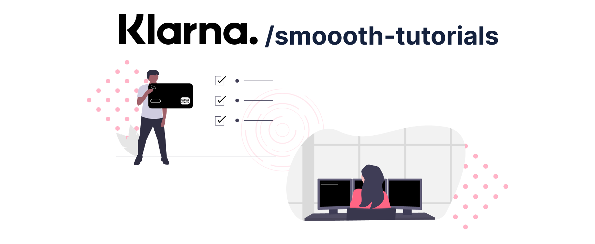

# Klarna Smoooth Tutorials

[![License][license-image]][license-url]
[![Developed at Klarna][klarna-image]][klarna-url]

> This repository hosts all code examples for the Klarna Smoooth Tutorials.

It includes examples of integrating Klarna within the following application types.

### Next.js

Next.js is a server-side rendering framework based on React. If you have a React-based application this tutorial is probably what you want to have a look at. You can find it under the following links:

- 📹 Video: https://youtube.com
- 💻 Code: [here](./klarna-checkout-101/integrate-from-scratch)
- 📄 Docs: [Klarna Developers](https://developers.klarna.com/documentation/klarna-checkout/)

### Are you missing an example?

Create an [issue](https://github.com/klarna-incubator/smoooth-tutorials/issues) and describe what example you want to see. We will continously work on providing as many examples as possible.

## How to contribute

Wanna contribute your own example? See our guide on [contributing](.github/CONTRIBUTING.md).

## Release History

See our [changelog](CHANGELOG.md).

## License

Copyright © 2021 Klarna Bank AB

For license details, see the [LICENSE](LICENSE) file in the root of this project.

<!-- Markdown link & img dfn's -->
[license-image]: https://img.shields.io/badge/license-Apache%202-blue?style=flat-square
[license-url]: http://www.apache.org/licenses/LICENSE-2.0
[klarna-image]: https://img.shields.io/badge/%20-Developed%20at%20Klarna-black?labelColor=ffb3c7&style=flat-square&logo=data:image/png;base64,iVBORw0KGgoAAAANSUhEUgAAABAAAAAOCAYAAAAmL5yKAAAAAXNSR0IArs4c6QAAAIRlWElmTU0AKgAAAAgABQESAAMAAAABAAEAAAEaAAUAAAABAAAASgEbAAUAAAABAAAAUgEoAAMAAAABAAIAAIdpAAQAAAABAAAAWgAAAAAAAALQAAAAAQAAAtAAAAABAAOgAQADAAAAAQABAACgAgAEAAAAAQAAABCgAwAEAAAAAQAAAA4AAAAA0LMKiwAAAAlwSFlzAABuugAAbroB1t6xFwAAAVlpVFh0WE1MOmNvbS5hZG9iZS54bXAAAAAAADx4OnhtcG1ldGEgeG1sbnM6eD0iYWRvYmU6bnM6bWV0YS8iIHg6eG1wdGs9IlhNUCBDb3JlIDUuNC4wIj4KICAgPHJkZjpSREYgeG1sbnM6cmRmPSJodHRwOi8vd3d3LnczLm9yZy8xOTk5LzAyLzIyLXJkZi1zeW50YXgtbnMjIj4KICAgICAgPHJkZjpEZXNjcmlwdGlvbiByZGY6YWJvdXQ9IiIKICAgICAgICAgICAgeG1sbnM6dGlmZj0iaHR0cDovL25zLmFkb2JlLmNvbS90aWZmLzEuMC8iPgogICAgICAgICA8dGlmZjpPcmllbnRhdGlvbj4xPC90aWZmOk9yaWVudGF0aW9uPgogICAgICA8L3JkZjpEZXNjcmlwdGlvbj4KICAgPC9yZGY6UkRGPgo8L3g6eG1wbWV0YT4KTMInWQAAAVBJREFUKBVtkz0vREEUhsdXgo5qJXohkUgQ0fgFNFpR2V5ClP6CQu9PiB6lEL1I7B9A4/treZ47c252s97k2ffMmZkz5869m1JKL/AFbzAHaiRbmsIf4BdaMAZqMFsOXNxXkroKbxCPV5l8yHOJLVipn9/vEreLa7FguSN3S2ynA/ATeQuI8tTY6OOY34DQaQnq9mPCDtxoBwuRxPfAvPMWnARlB12KAi6eLTPruOOP4gcl33O6+Sjgc83DJkRH+h2MgorLzaPy68W48BG2S+xYnmAa1L+nOxEduMH3fgjGFvZeVkANZau68B6CrgJxWosFFpF7iG+h5wKZqwt42qIJtARu/ix+gqsosEq8D35o6R3c7OL4lAnTDljEe9B3Qa2BYzmHemDCt6Diwo6JY7E+A82OnN9HuoBruAQvUQ1nSxP4GVzBDRyBfygf6RW2/gD3NmEv+K/DZgAAAABJRU5ErkJggg==
[klarna-url]: https://github.com/klarna-incubator
